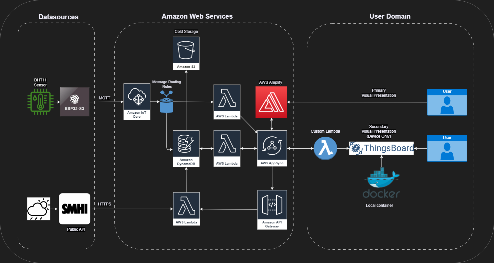
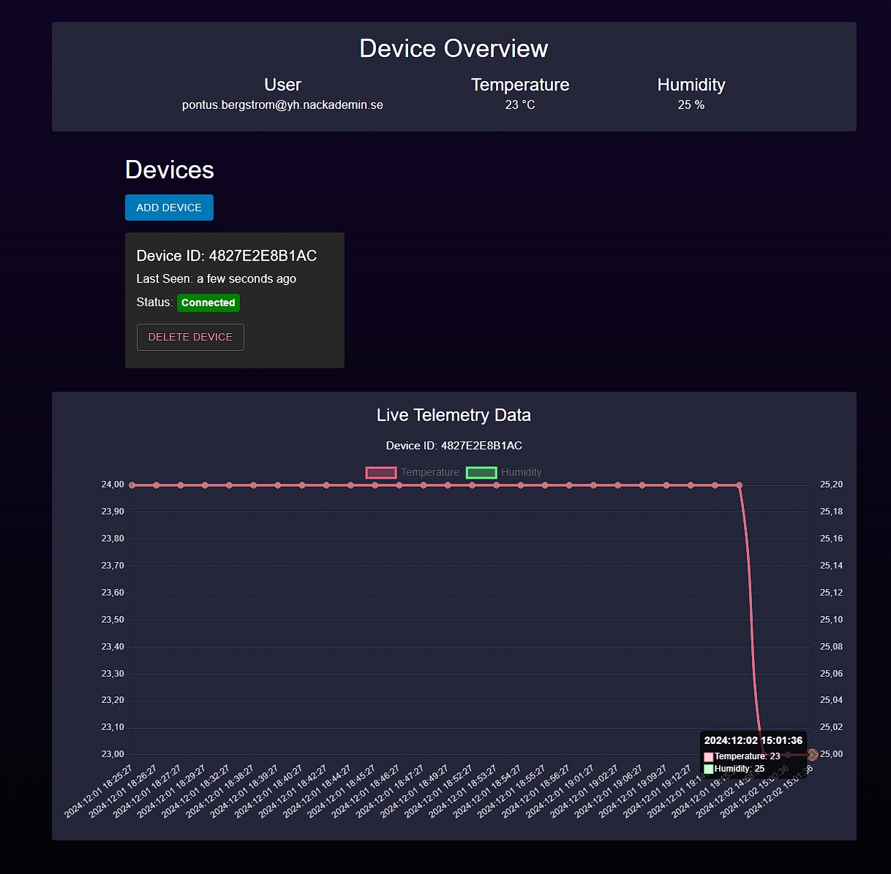
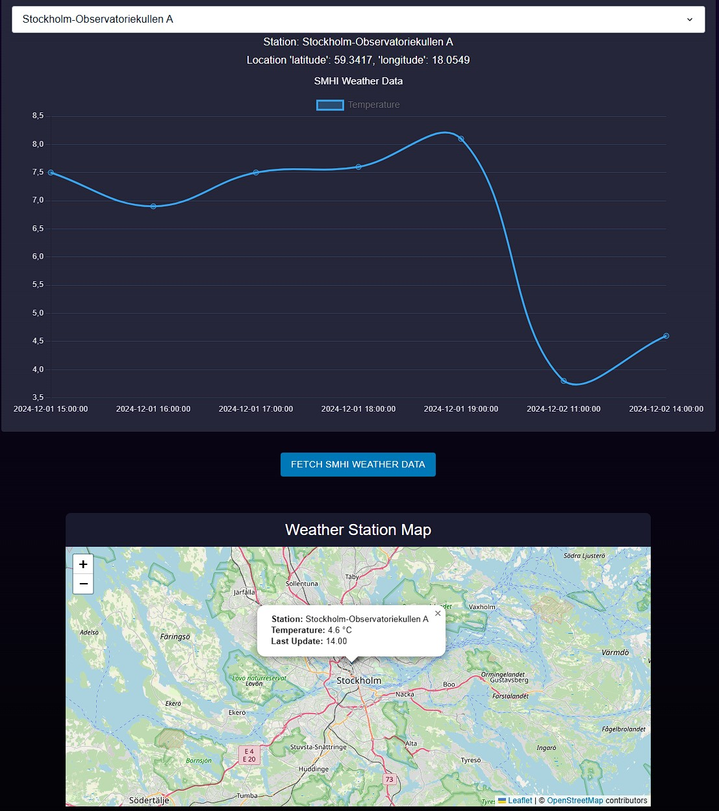
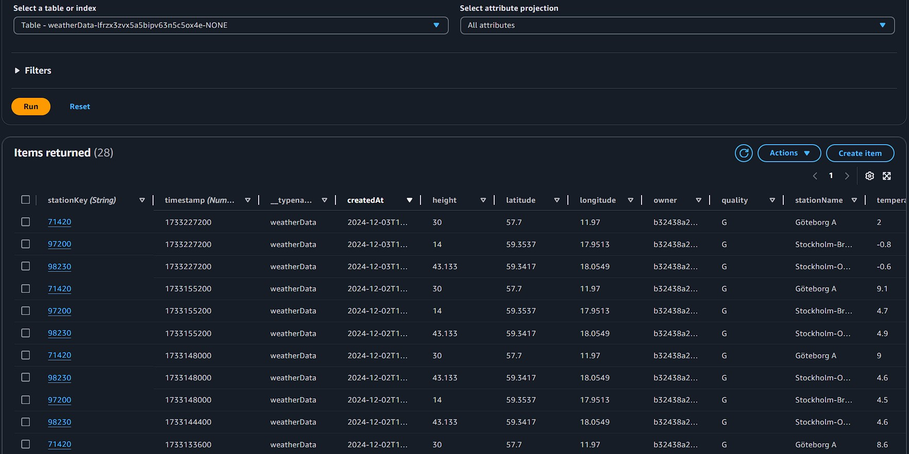
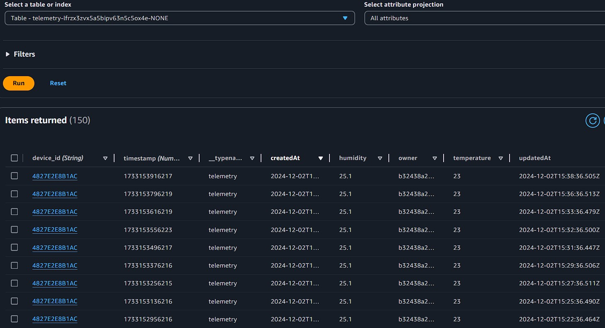

# Cloud Sensor Integration Frontend - AWS Amplify

## Table of Contents

1. [Overview](#overview)
2. [Flowchart](#flowchart)
3. [Features](#features)
4. [Integration with AWS](#integration-with-aws)
5. [Security](#security)
6. [Scalability and Future Improvements](#scalability-and-future-improvements)
7. [Known Issues](#known-issues)
8. [File and Folder Structure](#file-and-folder-structure)
9. [Examples - Screenshots](#examples---screenshots)
10. [Acknowledgments](#acknowledgments)
11. [License](#license)
12. [Sources](#sources)

## Overview

This repository is part of the [Cloud Sensor Integration repository](https://github.com/PBergstrom90/Cloud_Sensor_Integration). It focuses on the frontend development and integration with AWS Amplify services, providing a responsive and dynamic interface for IoT devices and weather telemetry.

The solution is designed to:
- **Scale easily** by leveraging AWS cloud services like DynamoDB, AppSync, and Cognito.
- **Ensure security** through best practices and secure authentication methods.
- **Integrate external APIs**, such as the SMHI Open Data API, for live weather data visualization.

For general information about the overarching project, visit the [Cloud Sensor Integration repository](https://github.com/PBergstrom90/Cloud_Sensor_Integration).

## Flowchart

This flowchart visualizes the entire application architecture, showcasing how AWS Amplify, IoT devices, and external APIs interact to provide a seamless user experience.

## Features

- **Authentication**: Secure user authentication with Amazon Cognito.
- **GraphQL API**: Flexible and scalable endpoints powered by AWS AppSync.
- **Real-time Database**: DynamoDB integration for telemetry, device, and weather data storage.
- **Dynamic Visualization**: Charts, maps, and dashboards for monitoring telemetry and weather data.
- **External API Integration**: Fetch and display live weather data from the SMHI Open Data API.

## Integration with AWS

This project integrates multiple AWS services through AWS Amplify. Amplify acts as the central framework, connecting the frontend to the backend and facilitating seamless interaction between the components. It simplifies the integration of backend services like DynamoDB, AppSync, and Lambda with the React application, ensuring secure and scalable data flow. Below is a summary of the key AWS services and their roles:

### Amazon IoT Core
Receives telemetry data (e.g., temperature, humidity) from the ESP32-S3 via MQTT. The data is routed to AWS Lambda and DynamoDB, where Amplify accesses it for frontend display.

### AWS Lambda
Executes backend logic for tasks such as:
- Storing telemetry and weather data in DynamoDB.
- Fetching weather data from the SMHI Open Data API.
- Handling GraphQL mutations managed by Amplify.

### Amazon DynamoDB
Serves as the real-time database for telemetry, device, and weather data. Amplify connects directly to DynamoDB through AppSync to provide fast, queryable data access in the frontend.

### AWS AppSync
Manages the GraphQL API, enabling efficient querying and mutation of data stored in DynamoDB. 
- **Queries** are used to retrieve data from the database for display on the frontend.
- **Mutations** are used to create, update, or delete data in the database. For example:
  - When a user adds a new IoT device, a mutation is triggered to save the device information to DynamoDB.
  - Similarly, when telemetry data is sent from the ESP32-S3, a mutation stores the data in the database. 

### Amazon API Gateway
Provides REST endpoints that allow Amplify to interact with backend functions like fetching live weather data from SMHI.

### Amazon S3
Amazon S3 is used as a scalable and durable storage solution for archiving or managing static resources. Currently, the project saves data to S3 for storage, but functionality to fetch and utilize this archived data is not yet implemented.

## Security

This project adheres to security best practices, including:
- Role-based access control for sensitive data using AWS Cognito and DynamoDB.
- Use of API keys for secure communication between Lambda functions and GraphQL.
- HTTPS for secure data transmission.
- Error boundaries and fail-safe mechanisms for robust frontend performance.

See the [CONTRIBUTING](CONTRIBUTING.md#security-issue-notifications) file for more details on security issue notifications.

## Scalability and Future Improvements

- **Improved API Gateway Authorization**: Explore and implement a method to fetch individual JWT tokens for signed-in users during runtime to enable additional authorization checks and strengthen security.

- **Frontend Enhancements**: Add more customization options for visualizing weather data and telemetry, allowing users to personalize their experience.

- **Additional Telemetry Charts**: Introduce support for multiple telemetry charts to display data from various devices simultaneously or compare historical data trends.

- **Expanded Weather Station Support**: Currently, the application supports three default SMHI weather stations. Future iterations aim to integrate the entire SMHI catalogue of active open data sources, enabling broader weather data visualization and analysis.

- **Utilize Saved S3 Storage Data**: Extend functionality to fetch and visualize archived data stored in Amazon S3. This would enable users to analyze historical trends and access older telemetry or weather data.

## Known Issues

- **API Gateway Authorization**: In AWS Amplify Gen2, I have not yet found a way to fetch individual JWT tokens for signed-in users during runtime. This limitation currently prevents the API Gateway from performing additional authorization checks based on user credentials. As a result, the API Gateway relies solely on the default authentication settings. This issue is under investigation, and potential solutions are being explored.

- **Data Refresh on Map**: After fetching weather data, the weather station map does not automatically update to reflect the latest data. Currently, a manual page reload is required to refresh the GUI and display the new data. This is a temporary workaround, and plans are in place to implement automatic updates in future iterations.

## File and Folder Structure

### Amplify Folder

- `auth/resource.ts`:
Configures email-based user authentication using Amazon Cognito.

- `data/resource.ts`:
Defines schemas for telemetry, devices, weather stations, and weather data, with secure authorization modes.

- `graphqlIoTCoreStatus`:
Handles device status updates using GraphQL mutations and environment configuration.

- `graphqlIoTCoreTelemetry`:
Logs telemetry data (temperature, humidity, timestamp) from IoT devices into the database using GraphQL.

- `smhiWeatherTelemetry`:
Fetches weather data from the SMHI Open API, checks for duplicates, and stores it in the database.

### Src Folder

- `App.tsx`:
Main application component managing authentication, weather stations, telemetry, and frontend layout with dynamic charts and maps. It also imports all files from the `Components`-folder to streamline code maintenance and modularity.

- `main.tsx`:
Entry point for the React application. Configures AWS Amplify and wraps the app with authentication.

- `AppWrapper.tsx`:
Applies a dark theme and global error handling to the main application.

- `ErrorBoundary.tsx`:
Catches runtime errors and displays fallback UI.

- `App.css`:
Defines global styles and animations.

#### Components Folder

- `DeviceOverview.tsx`:
Displays an overview of the latest telemetry data (temperature, humidity) and user details.

- `DevicesSection.tsx`:
Lists devices with their statuses and provides functionality to add or delete devices.

- `TelemetryChartData.tsx`:
Displays telemetry data (temperature, humidity) in a line chart with an option to delete data points.

- `WeatherChartData.tsx`:
Visualizes weather data for a selected weather station in a line chart.

- `WeatherMap.tsx`:
Shows a map with the selected weather station's location, temperature, and timestamp.

- `WeatherOverview.tsx`:
Provides a high-level overview section for weather-related data.

## Examples - Screenshots

### Device Overview and Telemetry

  

*“Visual confirmation that the connected device is sending data to DynamoDB, presented in a time chart. Also displays the signed-in user and the latest telemetry data at the top.”*

---

### Weather Telemetry and Map

  

*“Visual representation of fetched weather data from SMHI Open Data over time, as well as a map marker for the selected weather station.”*

--

 

*“Example of saved weatherdata in DynamoDB.”*

--

 

*“Example of saved devicedata in DynamoDB.”*

-- 

## Acknowledgments

Special thanks to my courseteacher **Johan Holmberg** for his instructions, and for the development of the `graphqlIoTCoreTelemetry` and `graphqlIoTCoreStatus` functions. 

## License

This project is licensed under the MIT-0 License. See the LICENSE file for details.

## Sources

- [SMHI Open Data API Documentation](https://opendata.smhi.se/apidocs/metfcst/index.html)

- [AWS IoT Core Documentation](https://docs.aws.amazon.com/iot/)

- [AWS Amplify Documentation](https://docs.amplify.aws/react/how-amplify-works/)